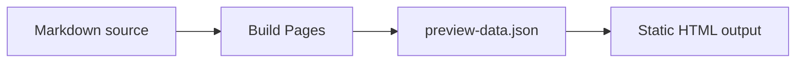

# Markdown Feature Examples

This page is written as ordinary Markdown and rendered by Build Pages. It is a practical sample for checking how common Markdown features appear in the bundled docs theme.

Use it when evaluating typography, spacing, code highlighting, alerts, tables, lists, images, embedded media, and Mermaid-style diagram fences.

## Paragraphs, Emphasis, And Links

Markdown paragraphs are converted into readable document prose. Inline emphasis such as **strong text**, _emphasized text_, ~~struck text~~, and `inline code` should remain easy to scan in the middle of a sentence.

Links use normal Markdown syntax. For example, the [Build Pages package](https://www.npmjs.com/package/@zeropress/build-pages) points to npm, and [the source tree guide](../../reference/project-structure/index.md) points to another local Markdown page.

Raw HTML links can opt into a new tab with `target="_blank"`. Build Pages keeps `_blank` and adds the safe `rel` values during Markdown rendering:

<a href="https://zeropress.dev/theme-authoring/" target="_blank">Open the ZeroPress Theme Authoring Guide</a>

## Heading Hierarchy

Headings become anchorable sections. The right-side table of contents is generated from headings when the theme renders `page.toc`.

### Third-Level Heading

Third-level headings should appear subordinate to the section heading but remain visible enough for long guides.

#### Fourth-Level Heading

Fourth-level headings are useful for compact details inside a section.

## Lists

Unordered lists are useful for short related facts:

- Markdown files are discovered from the source directory.
- The page route is derived from the source path unless front matter overrides it.
- Public files are copied from the public directory.

Ordered lists are useful for procedures:

1. Create Markdown files.
2. Add optional `.zeropress/config.json`.
3. Run Build Pages.
4. Deploy the generated output.

Nested lists should keep indentation readable:

- Repository
  - `docs/`
  - `public/`
  - `theme/`
- Output
  - HTML pages
  - hashed theme assets
  - generated special files

## Task Lists

GitHub-flavored task lists are supported.

- [x] Write Markdown source
- [x] Build the static site
- [ ] Review the generated output
- [ ] Deploy to a static host

## Blockquotes

Blockquotes are useful for callouts that do not need a semantic alert.

> Static output should remain readable, linkable, and inspectable without requiring a client-side application runtime.
>
> This is especially useful for documentation, manuals, policies, and long-lived reference pages.

## GitHub-Style Alerts

GitHub-style alerts are supported in Markdown source.

> [!NOTE]
> Use alerts for short, high-signal notes. They should not replace normal section structure.

> [!TIP]
> Keep Markdown pages front-matter-light when the default route and title behavior already matches the document.

> [!IMPORTANT]
> `status: draft` means the Markdown file is not generated as a page.

> [!WARNING]
> `discoverability: delist` is not access control. The page still exists at its URL.

> [!CAUTION]
> Do not put private content in a static site just because it is omitted from menus or search.

## Tables

Tables are useful for compact comparisons.

| Feature | Source | Output |
| --- | --- | --- |
| Page title | Front matter or first H1 | `page.title` |
| Description | Front matter `description` | `page.excerpt` |
| Route | Source path or front matter `path` | HTML route |
| Source copy | `copy-markdown-source` | Public `.md` link |

Pipe table separator rows and alignment markers are supported.

| Left | Center | Right |
| :--- | :---: | ---: |
| route | page title | 1 |
| public file | copied asset | 24 |
| generated HTML | output route | 128 |

## Fenced Code Blocks

Fenced code blocks keep language classes. When the language is recognized by ZeroPress's Markdown renderer, syntax highlighting is applied during build.

```json
{
  "version": "0.1",
  "site": {
    "title": "My Docs",
    "description": "Documentation built with ZeroPress."
  }
}
```

```yaml
name: Build Docs
on:
  push:
    branches: ["main"]
jobs:
  build:
    runs-on: ubuntu-latest
```

```js
export async function build() {
  const result = await runBuildPages({
    source: "./docs",
    destination: "./_site"
  });

  return result.files;
}
```

Unknown or plain text fences still render as code blocks.

```txt
docs/
  index.md
  guide.md
public/
  favicon.svg
```

## Mermaid Fence

Mermaid fences remain readable source without JavaScript. This theme progressively enhances them into diagrams when JavaScript is available.



## Images

Markdown images use normal image syntax.


Raw HTML image structures can be useful when a document needs captions or responsive media markup.

<figure>
  
  <figcaption>A public asset rendered from Markdown raw HTML.</figcaption>
</figure>

## External Embeds

Safe iframe embeds are useful when source Markdown already contains provider embed code. The iframe should include a meaningful `title`.

<iframe width="560" height="315" src="https://www.youtube-nocookie.com/embed/UYmvFzDuO5k" title="YouTube video player sample" allowfullscreen>
</iframe>

The theme should keep iframe embeds responsive on narrow screens.

## Native Media

Raw HTML media elements can embed site-owned video and audio files. Build Pages rewrites source-relative public asset paths to output-root URLs:

<video controls muted playsinline poster="../../../public/media/video-poster.jpg" width="640">
  <source src="../../../public/media/video.mp4" type="video/mp4">
  <track src="../../../public/media/captions-en.vtt" kind="captions" srclang="en" label="English">
</video>

<audio controls controlsList="nodownload" preload="metadata">
  <source src="../../../public/media/audio.mp3" type="audio/mpeg">
</audio>

The source Markdown can use GitHub-friendly relative public asset paths:

```html
<video controls muted playsinline poster="../../../public/media/video-poster.jpg" width="640">
  <source src="../../../public/media/video.mp4" type="video/mp4">
  <track src="../../../public/media/captions-en.vtt" kind="captions" srclang="en" label="English">
</video>

<audio controls controlsList="nodownload" preload="metadata">
  <source src="../../../public/media/audio.mp3" type="audio/mpeg">
</audio>
```

## Horizontal Rule

Horizontal rules are useful for separating examples from reference text.

---

The content after the rule should keep normal paragraph spacing.

## Escaping And Raw Text

Markdown can show characters that would otherwise be interpreted as markup:

- Use backticks for literal values like `{{site.title}}`.
- Escape Markdown punctuation when needed: \*not emphasized\*.
- Use code fences for template examples.

```html
{{#if page.collection_cursor.next}}
  <a href="{{page.collection_cursor.next.url}}">
    {{page.collection_cursor.next.title}}
  </a>
{{/if}}
```

## Compact Reference

Use this checklist when reviewing a Build Pages theme against Markdown output:

- Headings have clear hierarchy and enough spacing.
- Tables are readable on narrow screens.
- Code blocks scroll horizontally without breaking layout.
- Alerts are visually distinct but not louder than page headings.
- Images, captions, and links are accessible.
- The page remains useful when JavaScript is disabled.
