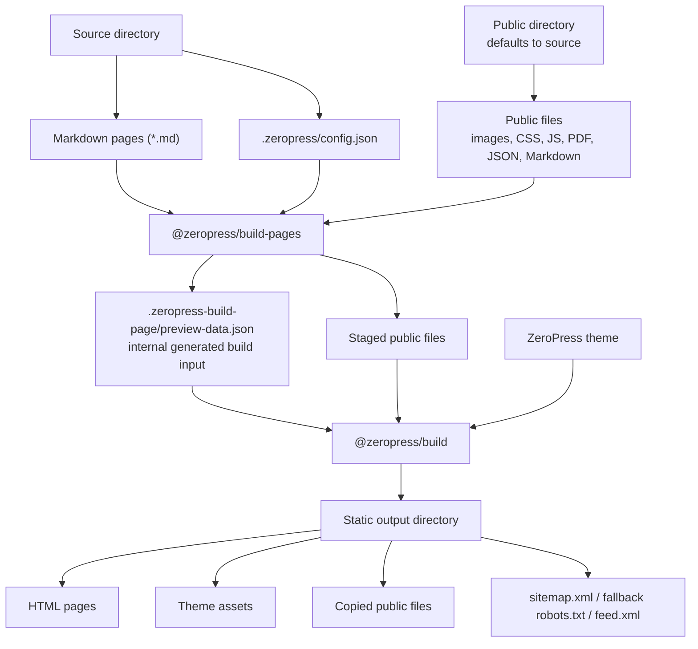

# @zeropress/build-pages


Build ZeroPress static output for modern hosting platforms.

`@zeropress/build-pages` turns Markdown files and public assets into a static ZeroPress site. It discovers Markdown pages, prepares the site data, stages public files, and runs [`@zeropress/build`](https://github.com/zeropress-app/zeropress-build).

The generated output is plain static files that can be deployed to GitHub Pages, Cloudflare Pages, Netlify, Vercel, or any static hosting provider.

## Build Flow

```txt
source directory
  Markdown pages + .zeropress/config.json
public directory
  public files (defaults to source)
        |
        v
@zeropress/build-pages
  generates .zeropress-build-page/preview-data.json
  stages public files
        |
        v
@zeropress/build + ZeroPress theme
        |
        v
static output directory
  HTML pages + assets + copied public files
```



## Usage

### GitHub Action

A basic Pages deployment workflow with the `zeropress-build-pages` action looks like this.

```yaml
name: Build and Deploy Docs to GitHub Pages
on:
  push:
    branches: ["main"]
  workflow_dispatch:
permissions:
  contents: read
  pages: write
  id-token: write
concurrency:
  group: "pages"
  cancel-in-progress: false
jobs:
  build:
    runs-on: ubuntu-latest
    steps:
      - name: Checkout
        uses: actions/checkout@v6
      - name: Setup Pages
        uses: actions/configure-pages@v6
      - name: Build ZeroPress Pages
        uses: zeropress-app/zeropress-build-pages@v0
        with:
          source: ./docs
          destination: ./_site
      - name: Upload artifact
        uses: actions/upload-pages-artifact@v5
  deploy:
    runs-on: ubuntu-latest
    needs: build
    environment:
      name: github-pages
      url: ${{ steps.deployment.outputs.page_url }}
    steps:
      - name: Deploy to GitHub Pages
        id: deployment
        uses: actions/deploy-pages@v5
```

The action `zeropress-build-pages` builds the static files only. Uploading and deploying are handled by your hosting provider's deployment action or CLI.

Minimal action usage:

```yaml
- name: Build ZeroPress Pages
  uses: zeropress-app/zeropress-build-pages@v0
```

That is equivalent to:

```yaml
- name: Build ZeroPress Pages
  uses: zeropress-app/zeropress-build-pages@v0
  with:
    source: ./docs
    destination: ./_site
    theme: docs
    skip-untitled-markdown: false
    skip-link-check: false
    copy-markdown-source: true
```

Custom input example:

```yaml
- name: Build ZeroPress Pages
  uses: zeropress-app/zeropress-build-pages@v0
  with:
    source: ./docs
    public-dir: ./public
    destination: ./_site
    theme-path: ./theme-docs
    config: ./docs/.zeropress/config.json
    site-url: https://example.com/docs
    copy-markdown-source: false
```

Separate public asset directory example:

```yaml
- name: Build ZeroPress Pages
  uses: zeropress-app/zeropress-build-pages@v0
  with:
    source: ./docs
    public-dir: ./public
    destination: ./_site
```

In the action inputs:

- `source` is the directory that contains your Markdown pages and optional `.zeropress/config.json`. The default is `./docs`.
- `public-dir` is the directory copied as public passthrough files. The default is `source`. If you set it explicitly, the directory must exist.
- `destination` is the directory where the generated static site is written. The default is `./_site`.
- `theme` is the bundled theme name. The default is `docs`; `docs1` is an alias for `docs`.
- `theme-path` is a custom local ZeroPress theme directory. It takes precedence over `theme`.
- `config` is the config file path. The default is `<source>/.zeropress/config.json`.
- `site-url` overrides the canonical site URL from config.
- `skip-untitled-markdown` skips Markdown files without a page title instead of failing. The default is `false`.
- `skip-link-check` skips internal link checking after build. The default is `false`; broken internal links are reported as warnings and do not fail the build.
- `copy-markdown-source` copies original Markdown files to the generated output and enables `View this page as Markdown` links in the bundled docs theme. The default is `true`; when set to `false`, public `.md` passthrough files are also skipped.

For GitHub Pages, the generated `destination` directory can be passed to `actions/upload-pages-artifact`. For Cloudflare Pages, Netlify, Vercel, or another static host, pass the same `destination` directory to that provider's deploy step.

Need a custom theme? Start with [`@zeropress/create-theme`](https://www.npmjs.com/package/@zeropress/create-theme), then point `theme-path` to the generated `theme/` directory:

```bash
npx @zeropress/create-theme --name my-docs-theme --template docs
```

```yaml
with:
  source: ./docs
  public-dir: ./public
  destination: ./_site
  theme-path: ./my-docs-theme/theme
```

### Vercel

Use the `Other` framework preset and set the generated output directory as Vercel's Output Directory.

Project settings:

| Setting | Value |
| --- | --- |
| Framework Preset | `Other` |
| Build Command | `npx --yes @zeropress/build-pages --source ./docs --destination ./_site` |
| Output Directory | `_site` |

If your public assets live outside the source directory, include `--public-dir`:

```bash
npx --yes @zeropress/build-pages --source ./docs --public-dir ./public --destination ./_site
```

If your project uses a `package.json` script, set the Vercel Build Command to `npm run build` and keep the Output Directory as `_site`.

### npx

Use `npx` when you want to run Build Pages without adding it to your project dependencies.

```bash
npx @zeropress/build-pages --source ./docs --destination ./_site
```

### package.json script

Use a package script when your project already has a Node.js toolchain.

```bash
npm install --save-dev @zeropress/build-pages
```

```json
{
  "scripts": {
    "build": "zeropress-build-pages --source ./docs --destination ./_site"
  }
}
```

```bash
npm run build
```

## CLI Options

The CLI requires explicit input and output paths. The GitHub Action keeps safe defaults for workflow convenience.

| Option | Default | Purpose |
| --- | --- | --- |
| `--source <dir>` | required | Dedicated source directory containing Markdown and optional config |
| `--public-dir <dir>` | source | Public passthrough directory. Explicit paths must exist. |
| `--destination <dir>` | required | Output directory |
| `--theme <name>` | `docs` | Bundled theme name. `docs1` aliases `docs`. |
| `--theme-path <dir>` | none | Custom ZeroPress theme directory |
| `--config <path>` | `<source>/.zeropress/config.json` | Build Pages config |
| `--site-url <url>` | config `site.url` | Canonical URL override |
| `--skip-untitled-markdown` | `false` | Skip Markdown without a page title |
| `--skip-link-check` | `false` | Skip warning-only internal link checking |
| `--no-copy-markdown-source` | `false` | Do not copy source Markdown or public `.md` files to output |

## Source Tree

The source directory is the folder that Build Pages reads for Markdown pages and optional `.zeropress/config.json`. By default, the source directory is also the public passthrough root. Use `public-dir` when you want to keep Markdown source and public assets separate.

Use a dedicated content directory such as `docs/` or `documents/`. Repository root source (`--source ./`) is not supported.

```txt
my-site/
  docs/                 # source
    index.md
    guide.md
    .zeropress/
      config.json
  public/               # public-dir, optional
    assets/
      logo.png
    favicon.svg
    robots.txt
  _site/                # destination, generated
```

Build Pages stages the public directory before calling [`@zeropress/build`](https://github.com/zeropress-app/zeropress-build). Generated ZeroPress output wins over staged public files.

Root-level public files named `favicon.ico`, `favicon.svg`, `favicon.png`, and `apple-touch-icon.png` are copied to the destination and auto-injected into generated HTML `<head>` output.

A root-level public `sitemap.xsl` is copied to the destination. When ZeroPress generates `sitemap.xml`, it auto-discovers that file and adds an XML stylesheet processing instruction for `/sitemap.xsl`.

The source directory must not overlap the destination directory, the selected theme directory, or the internal `.zeropress-build-page/` working directory. An explicit public directory must be an existing dedicated directory and must not be a file, symlink, repository root, destination directory, selected theme directory, or internal `.zeropress-build-page/` working directory.

If `public-dir` is inside `source`, Build Pages excludes that public subtree from Markdown page discovery.

Ignored while copying public passthrough files and discovering Markdown pages:

- hidden paths such as `.git`, `.env`, and `.zeropress`
- `node_modules`
- `Thumbs.db`
- `*.key`
- `*.pem`
- symlinks

Additional Markdown discovery ignores:

- path segments starting with `_`
- path segments starting with `#`
- path segments ending with `~`
- `vendor`

## Markdown Pages

- `*.md` files are discovered recursively.
- Each Markdown page needs a page title. Build Pages uses front matter `title`, then an ATX H1 (`# Title`), then a Setext H1 (`Title` + `====`).
- If no title can be found, the build fails unless `--skip-untitled-markdown` is used.
- `--skip-untitled-markdown` skips those Markdown files. It does not create untitled pages.
- Root `index.md` becomes the front page when no config is present.
- Nested `index.md` maps to a directory route, such as `cli/index.md` -> `/cli/`.
- Other Markdown files map to extensionless routes, such as `cli/tool.md` -> `/cli/tool`.
- Markdown links to other discovered `.md` files are rewritten to generated public URLs.
- Original Markdown files remain available as public passthrough files by default.
- Use `--no-copy-markdown-source` or Action input `copy-markdown-source: false` to keep source Markdown and public `.md` passthrough files out of the generated output. This also hides bundled theme `View this page as Markdown` links.

Optional YAML front matter is supported at the top of Markdown files:

```md
---
title: Install ZeroPress
description: Build a static docs site from Markdown.
path: guides/install
status: published
discoverability: default
meta:
  source: docs
data:
  stack:
    - ZeroPress
    - Cloudflare
  facts:
    - label: Role
      value: Documentation
---

Body content...
```

All supported front matter fields are optional. When `status` is omitted, the page is treated as `published`.

Supported front matter fields:

| Field | Purpose |
| --- | --- |
| `title` | Page title. Takes priority over Markdown H1. |
| `description` | Page excerpt and description. |
| `path` | Generated route path, such as `guides/install` for `/guides/install`. |
| `status` | `published` includes the page. `draft` skips the page. Other values warn and skip. |
| `discoverability` | `default`, `noindex`, or `delist`. Missing is `default`. |
| `meta` | Optional scalar/null metadata copied to the generated page. |
| `data` | Optional structured JSON-style data for theme-facing lists, facts, galleries, timelines, or swatches. |

Unknown front matter fields are ignored to make migration from existing Markdown sites easier.

`status` controls route generation. `status: draft` removes the Markdown file from generated preview-data and no HTML route is created.

`discoverability` controls automatic exposure after a route is generated:

- `default`: no special handling.
- `noindex`: generate the page and add HTML robots `noindex`.
- `delist`: generate the page, add HTML robots `noindex`, and exclude it from automatic discovery outputs such as sitemap, native search, and generated post/page listing data.

`delist` is not a security or permission feature. Direct links, explicit menus, explicit collections, and body links can still expose the page.

Use `meta` for small scalar flags and metadata. Use `data` when a theme should iterate structured content:

```html
{{#for fact in page.data.facts}}
  <dt>{{fact.label}}</dt>
  <dd>{{fact.value}}</dd>
{{/for}}
```

## Markdown Rendering

Build Pages renders Markdown through ZeroPress build-core before writing HTML.
This includes common Markdown extensions such as tables, strikethrough, task
lists, GitHub-style alerts, heading IDs, and fenced code blocks.

Fenced code blocks are highlighted at build time with `highlight.js`.

````md
```js
console.log("hello");
```
````

When a fenced code block has a language info string and `highlight.js`
recognizes it, ZeroPress uses that language. If the language is missing or not
recognized, ZeroPress falls back to automatic detection. The generated markup
keeps the `language-*` class and adds `hljs-*` token classes for highlighted
spans:

```html
<pre><code class="language-js">...</code></pre>
```

Themes only need CSS for the generated code markup. A client-side
`highlight.js` script is not required for Markdown rendered during the build.

ZeroPress build-core currently uses `highlight.js@11.11.1` and the built-in
languages returned by `hljs.listLanguages()`. In this release, that is 192
canonical language names, plus recognized aliases such as `js`, `ts`, `jsx`,
`sh`, and `zsh`. A language listed in the Highlight.js documentation with a
third-party package is not bundled by ZeroPress unless it is also present in
`hljs.listLanguages()`.

See the upstream
[`highlight.js@11.11.1` supported languages table](https://github.com/highlightjs/highlight.js/blob/11.11.1/SUPPORTED_LANGUAGES.md)
for language names, aliases, and third-party package notes. Common built-in
examples include `bash`, `shell`, `js`, `javascript`, `ts`, `typescript`,
`json`, `yaml`, `html`, `xml`, `css`, `scss`, `python`, `ruby`, `php`, `java`,
`go`, `rust`, `c`, `cpp`, `csharp`, `sql`, `graphql`, `dockerfile`, `nginx`,
`markdown`, and `diff`.

Mermaid is intentionally different: `mermaid` fences remain readable code
blocks such as `pre code.language-mermaid`. Diagram rendering is optional
progressive enhancement owned by the theme or site.

## Config

Build Pages reads `<source>/.zeropress/config.json` when present. Missing config falls back to defaults.

See the public config reference at [zeropress.dev/build-pages-config](https://zeropress.dev/build-pages-config/).

```json
{
  "$schema": "https://schemas.zeropress.dev/build-pages-config/v0.1/schema.json",
  "version": "0.1",
  "site": {
    "title": "My Docs",
    "description": "Project documentation",
    "url": "https://example.github.io/project",
    "logo": {
      "src": "/logo.svg",
      "alt": "My Docs"
    },
    "locale": "en-US",
    "expose_generator": true,
    "search": true,
    "indexing": true,
    "footer": {
      "copyright_text": "Copyright 2026 Example Corp.",
      "attribution": true
    },
    "meta": {
      "issue": "Spring 2026",
      "show_sponsor_banner": false
    }
  },
  "front_page": {
    "type": "markdown"
  },
  "menus": {
    "primary": {
      "name": "Primary Menu",
      "items": [
        { "title": "Home", "url": "/" },
        {
          "title": "Guide",
          "url": "/guide",
          "meta": {
            "icon": "book-open",
            "badge": "New"
          }
        }
      ]
    }
  },
  "custom_html": {
    "head_end": { "file": ".zeropress/head-end.html" },
    "body_end": { "file": ".zeropress/body-end.html" }
  }
}
```

`front_page` modes:

- `{ "type": "theme_index" }`: render bundled theme home.
- `{ "type": "markdown" }`: render `index.md` through `page.html`.
- `{ "type": "html" }`: render `.zeropress/index.html` through `page.html`.
- `{ "type": "html", "layout": false }`: write trusted standalone HTML directly.

HTML front page and `custom_html` files must stay inside `.zeropress/`.

Menu item `meta` is optional scalar display metadata copied into generated preview-data for themes that manually iterate menus. Use it for small values such as `icon`, `badge`, or `accent`; arrays and objects are not accepted.

`site.footer.copyright_text` is rendered by the bundled docs theme when present. If it is omitted, the bundled docs theme falls back to `site.title`. ZeroPress does not add a copyright symbol automatically.

The bundled docs theme shows `Published with ZeroPress.` by default. Set `site.footer.attribution` to `false` to hide it.

`site.logo` is optional theme-facing brand data. Use a root-relative public path for public logo files, or an absolute URL for media-hosted logos. Build Pages emits `media_base_url: ""`, so root-relative logo paths remain same-host public paths.

`site.locale` is optional language metadata copied into generated preview-data. It affects theme-facing `site.locale`, the common `language` render context value, generated HTML language metadata, and feed language. Missing `site.locale` defaults to `en-US`.

`site.meta` is an optional scalar extension map copied into generated preview-data. Use it for site-level theme conventions such as labels, feature flags, or issue names. Values must be strings, finite numbers, booleans, or null. Use first-class fields such as `site.logo.src` instead of ad hoc keys like `site.meta.logo_url`.

`site.expose_generator` controls the HTML generator meta tag. Missing or `true` emits `<meta name="generator" content="ZeroPress">`; set it to `false` for white-label sites.

`site.indexing` controls only the generated fallback `robots.txt`. Missing or `true` allows indexing; `false` writes `User-agent: *` / `Disallow: /`. If the public directory contains `robots.txt`, that file is copied as-is and takes priority over `site.indexing`. ZeroPress does not append a `Sitemap` directive to a public `robots.txt`; add `Sitemap: https://example.com/sitemap.xml` manually when needed.

Schemas:

- [ZeroPress Build Pages Config v0.1](https://schemas.zeropress.dev/build-pages-config/v0.1/schema.json)

## Search

The bundled docs theme supports ZeroPress native search. `site.search` controls whether search artifacts and bundled search UI are enabled.

Missing or `true` enables native search for the bundled docs theme. Build Pages writes `/_zeropress/search.json`, `/_zeropress/search.js`, and `/_zeropress/search_pagefind.js`.

Set `site.search` to `false` to omit those search artifacts and hide the bundled search form.

The bundled docs theme marks post/page body content with `data-pagefind-body`. If you run Pagefind after the ZeroPress build, keep the theme UI pointed at `/_zeropress/search.js` and replace the native adapter:

```bash
npx pagefind@latest --site ./_site --output-subdir _zeropress/pagefind
cp ./_site/_zeropress/search_pagefind.js ./_site/_zeropress/search.js
rm ./_site/_zeropress/search.json
```

## Workspace Internal `.zeropress-build-page/` Files

Build Pages reads optional user-authored site config from `<source>/.zeropress/config.json`. Separately, it writes generated internal working files to `.zeropress-build-page/` in the current working directory. These generated working files are not the final deploy output. The final static site is written to the `destination` directory.

```txt
.zeropress-build-page/
  build-pages-config.json
  preview-data.json
  build-report.json
  public-assets/
```

`build-pages-config.json` is the resolved user-facing Build Pages config used for the current run. It combines source config, defaults, and CLI or Action input overrides where applicable.

`preview-data.json` is an internal generated build input for the ZeroPress renderer. Most users do not need to edit or understand this file.

`build-report.json` records source/public roots, discovered Markdown counts, skipped Markdown files, front page resolution, source Markdown copy policy, and custom HTML slots.

`public-assets/` is a temporary staged public root used before the final ZeroPress render.

## Destination Output

The `destination` directory contains the deployable static site. It includes generated ZeroPress HTML, copied public files, and original Markdown files unless Markdown source copy is disabled or files are excluded by the public passthrough rules. A public `robots.txt` is copied as a site-owned policy file; otherwise ZeroPress writes a fallback `robots.txt` with a sitemap directive when `site.url` is available. Root-level public favicon files are copied and represented as generated HTML head links. A root-level public `sitemap.xsl` is copied and linked from generated `sitemap.xml`.

## Demo

- [zeropress.dev](https://github.com/zeropress-app/zeropress.dev) is built with `@zeropress/build-pages`.
